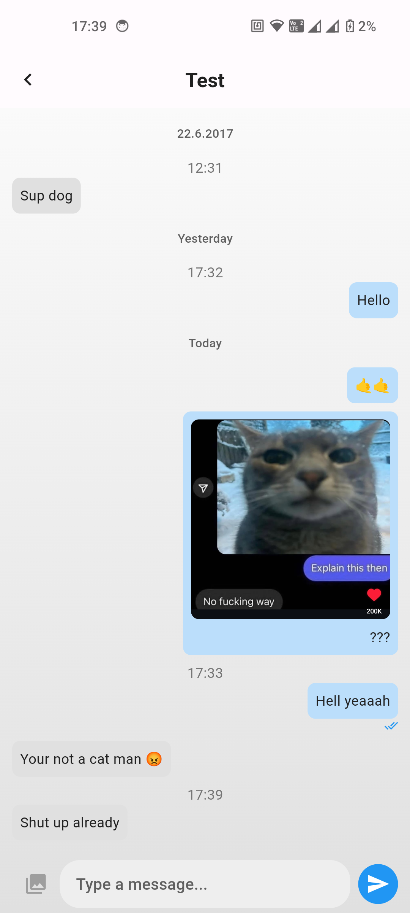
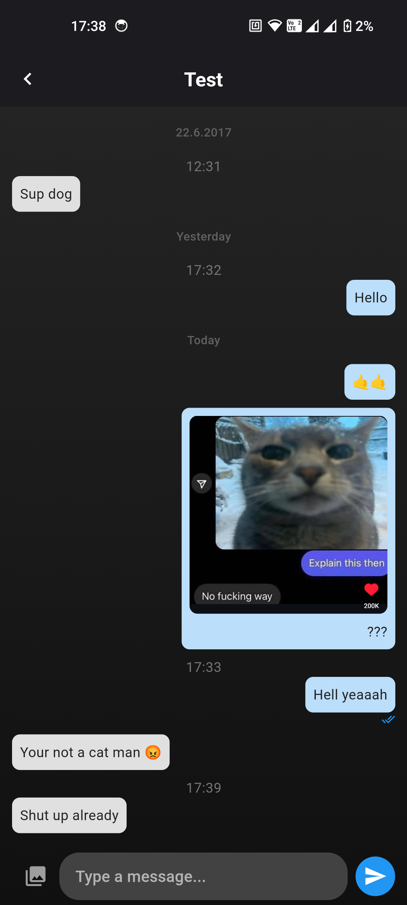
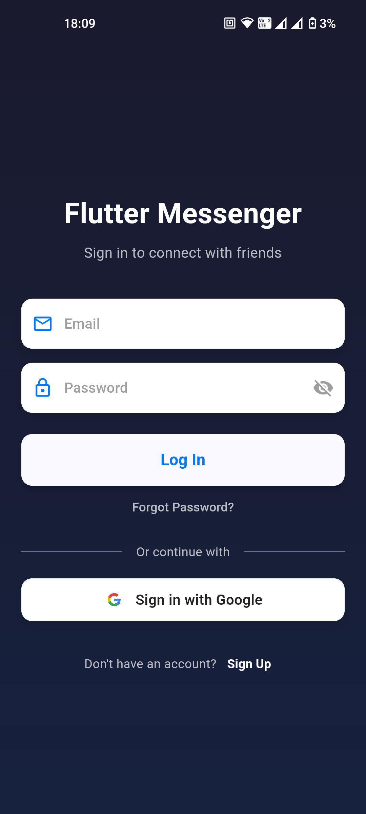
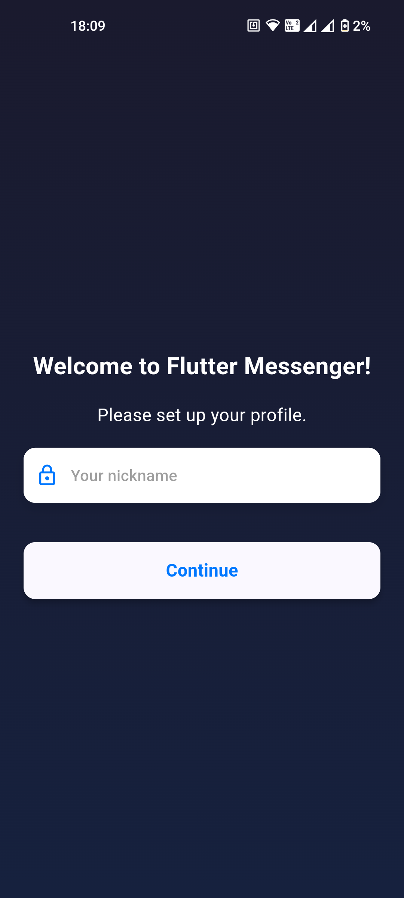

# Flutter-Messenger

A simple and modern real-time chat application built with Flutter and powered by Firebase. Includes support for authentication, text and image messages, and dark/light theme switching.
# Features

🔐 Firebase Authentication (email & password)

💬 Real-time messaging using Cloud Firestore

🔐 Encryption for messages

📸 Sending & displaying image messages with Firebase Storage

🌙 Light & Dark theme toggle

👥 User-based chat history

🧠 Clean and modular code structure

📱 Fully responsive and mobile-ready

----

| Chat Light Mode | Chat Dark Mode |
|-----------------|----------------|
|  |  |

| Login Screen | Welcome Page |
|--------------|--------------|
|  |  |

